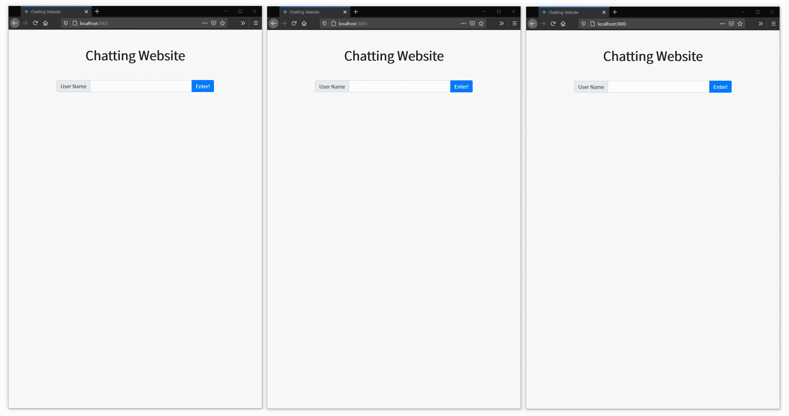
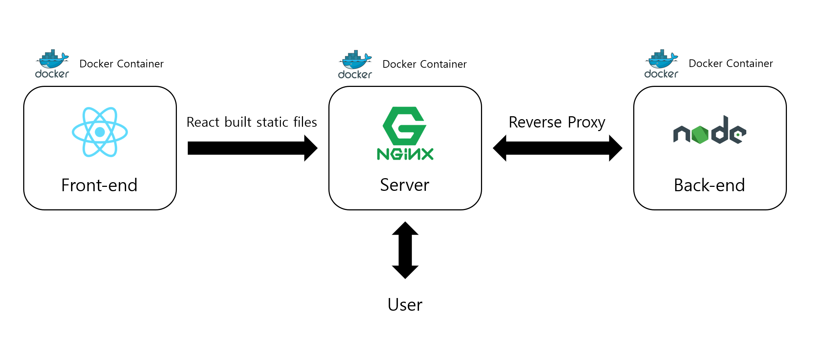

# Chatting Website

A simple implementation of a chatting website.



## Technical Stacks

* Back-end : Node.js, Socket.IO
* Front-end : React, Socket.IO
* Server : NGINX
* Also, everthing runs on Docker

## System Architecture



## Usage

### Configurations

1. Create `front/app/src/config.json`.

```json
{
    "server": "Back-end URI"
}
```

2. Edit `nginx/server.conf`.

Change `[SERVER NAME]` to correct address.

### Turn On

```
docker-compose build
docker-compose up -d
```

### Turn Off

```
docker-compose down
```
